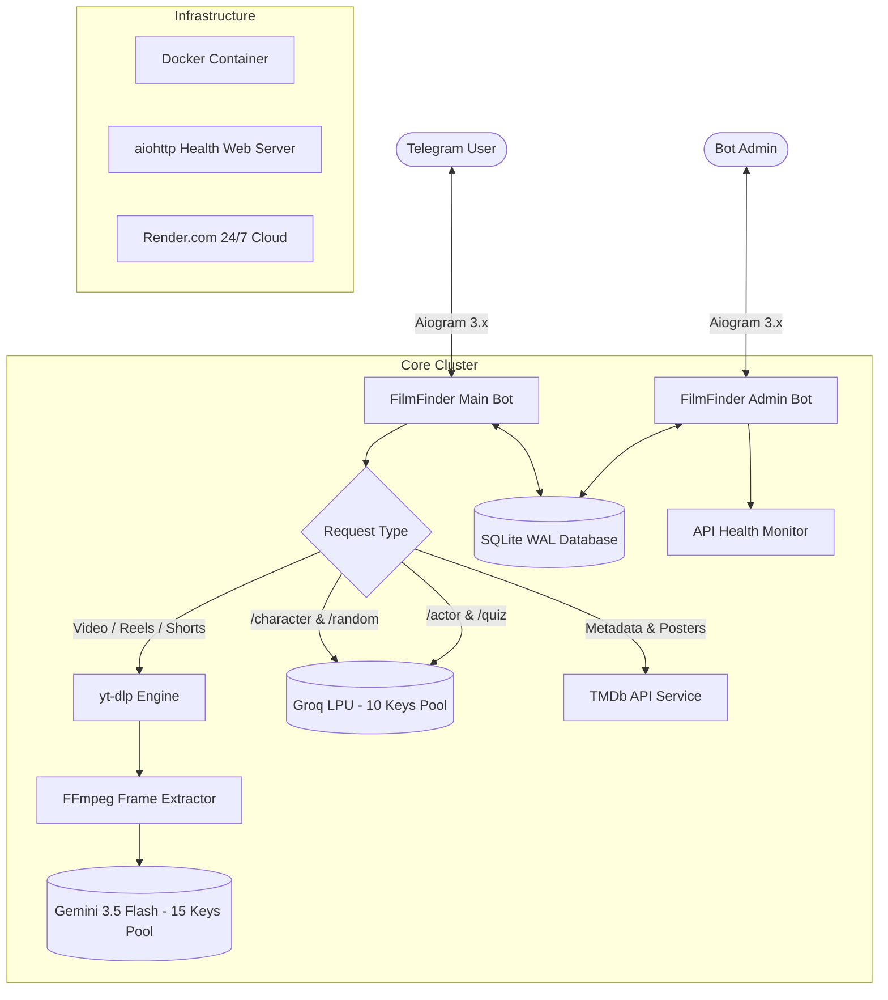

<div align="center">
  

  [](https://t.me/FilmAiFinderbot)
  [](https://t.me/filmfinder_admin_bot)
  [](https://www.python.org/)
  [](https://docs.aiogram.dev/)
  [](https://ai.google.dev/)
  [](https://groq.com/)
  [](https://www.docker.com/)
  [](https://render.com/)
</div>

---

## 🌟 Overview

**FilmFinder AI** is a production-grade, enterprise-scale Telegram Bot Cluster designed to identify any movie, TV series, anime, or cartoon from **Instagram Reels, TikTok, YouTube Shorts, video clips, screenshots, or vague plot descriptions**.

Powered by a **Dual-Engine AI Cluster**:
- 🧠 **Google Gemini 3.5 Flash (15 Keys Rotation Pool)**: Ultra-high precision multimodal vision analysis, FFmpeg frame extraction, and OCR.
- ⚡️ **Groq LPU Engine (10 Keys Rotation Pool)**: Sub-second (~0.3s) inference powering AI Character Roleplay, Mood-based Movie Curator, Actor Filmography, and Interactive Movie Trivia Quizzes.
- 👑 **Dedicated Independent Admin Bot**: Full live monitoring dashboard, key health tracking, broadcast system, and database backup exports.

---

## 🚀 Key Features

### 1. 🎥 Multimodal Vision & Video Recognition
- **Cross-Platform Support**: Instagram Reels, YouTube Shorts, TikTok, Pinterest, direct video files, and circular video notes.
- **Vision-First Frame Analysis**: Intelligent neural vision pipeline that extracts keyframes via FFmpeg and detects the true movie regardless of misleading social media captions or spam hashtags (e.g. anime tags on Hollywood action clips).
- **Rich Movie Cards**: Delivers local titles (Uzbek, Russian, English), IMDb ratings, official TMDb HD posters, trailers, and direct streaming links.

### 2. 🎭 Live AI Character Roleplay (`/character`)
- Converse in real-time with iconic movie characters powered by Groq LPU persona prompting:
  - 🃏 **Joker** (*"Why so serious? HA-HA-HA"*)
  - 🦇 **Batman** (*Gotham's Dark Knight*)
  - 🦾 **Tony Stark** (*Genius, Billionaire, Playboy, Philanthropist*)
  - 🐺 **Po'lat Alemdar** (*"Bu bir mafiya qissasidir..." — Kurtlar Vadisi*)
  - 🕵️‍♂️ **Sherlock Holmes** (*221B Baker Street deductive logic*)
  - ⚡️ **Harry Potter** (*Hogwarts magic & wizardry*)
  - 🏎 **Dominic Toretto** (*"Family is everything"*)

### 3. 🎲 AI Movie Curator & Mood Selector (`/random`)
- **AI Surprise Me**: Curates hidden cinematic masterpieces based on mood and era.
- **Dynamic Exclusion Memory**: Automatically avoids recommending films already seen or previously generated in the session.

### 4. ⭐️ Actor & Director Filmography Explorer (`/actor`)
- Input any actor or director name (e.g. `/actor Leonardo DiCaprio`, `/actor Christopher Nolan`).
- Returns official portrait photos, awards bio, and their top 5 all-time greatest cinematic masterpieces with 1-click watch buttons.

### 5. 🎮 AI Movie Trivia Quiz Game (`/quiz`)
- 4-choice interactive cinema trivia with instant answer validation, points scoring (+10 pts), and a global TOP-10 Leaderboard.

### 6. ❤️ Personal Watchlist & Premiere Alerts (`/saved`, `/alerts`)
- 1-click save to personal watchlist with direct streaming links.
- Premiere alerts for unreleased blockbuster movies and trailers.

### 7. 👑 FilmFinder Admin Bot (`@filmfinder_admin_bot`)
- **Live Statistics**: Total users, daily active joins, search counts, saved films, and active alerts.
- **Key Health Monitor**: Real-time health check across all 25 AI keys (15 Gemini + 10 Groq + TMDb).
- **Broadcast System**: Markdown-formatted broadcast engine with progress reporting.
- **Database Backup**: 1-click export of SQLite database (`users.db`) and user CSV data.
- **Sponsor Channel Gate**: Automatic verification and management of mandatory sponsor channels.

---

## 🏗 System Architecture



---

## 🛠 Tech Stack

- **Language**: Python 3.12+
- **Bot Framework**: [Aiogram 3.x](https://docs.aiogram.dev/) (Fully Asynchronous)
- **AI Engines**:
  - Google Gemini 3.5 Flash (`google-genai` SDK)
  - Groq LPU Inference (`groq` Python SDK — GPT-OSS 120B / Qwen 27B)
- **Video & Media**: `yt-dlp`, `imageio-ffmpeg`
- **Database**: SQLite3 with Write-Ahead Logging (WAL)
- **Deployment**: Docker & Render Cloud Web Service with aiohttp health-check daemon

---

## 🚀 Getting Started

### 1. Clone the repository
```bash
git clone https://github.com/khojayevramzbek-glitch/film-ai-finder-bot.git
cd film-ai-finder-bot
```

### 2. Create and activate virtual environment
```bash
python -m venv .venv
# On Windows:
.\.venv\Scripts\Activate.ps1
# On Linux/macOS:
source .venv/bin/activate
```

### 3. Install dependencies
```bash
pip install -r requirements.txt
```

### 4. Configure Environment Variables
Create a `.env` file in the root directory:
```env
BOT_TOKEN=your_main_telegram_bot_token
ADMIN_BOT_TOKEN=your_admin_telegram_bot_token

# Gemini API Keys (comma-separated for key-pool rotation)
GEMINI_API_KEYS=key1,key2,key3,...

# Groq API Keys (comma-separated)
GROQ_API_KEYS=gsk_key1,gsk_key2,...

# Optional TMDb API Key
TMDB_API_KEYS=your_tmdb_api_key

GEMINI_MODEL=gemini-3.5-flash
MAX_VIDEO_SIZE_MB=50
```

### 5. Run the Cluster
```bash
python run.py
```

---

## 👨‍💻 Author & Maintainer

**Ramzbek Khojayev**
- Telegram: [@khojayev_ramz](https://t.me/khojayev_ramz)
- GitHub: [@khojayevramzbek-glitch](https://github.com/khojayevramzbek-glitch)
- Portfolio: [khojayevramzbek-glitch.github.io/portfolio](https://khojayevramzbek-glitch.github.io/portfolio/)

---

<div align="center">
  <sub>Built with ❤️ for cinema lovers worldwide • Powered by AI & Open Source</sub>
</div>
